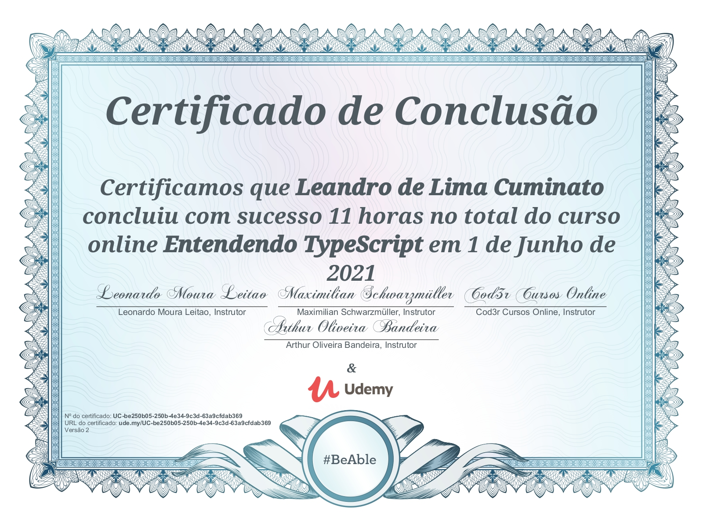

# TypeScript Course - COD3R

Repositório criado para registro de estudo durante o curso desenvolvido pela COD3R dentro da plataforma Udemy

Requisitos
---
Para executar o projeto, será necessário instalar de forma global:

1. [TypeScript (4.2.4)](https://www.npmjs.com/package/typescript/v/4.2.4)

Começando
---
Para iniciar o projeto será necessario clona-lo em uma pasta de sua preferência

```shell
git clone https://github.com/LeandrodeLimaC/TypescriptCourse.git
```

Navegue até a pasta criada e execute o seguinte comando para instalar as dependências do projeto
```shell
cd TypescriptCourse
npm install
```

Comandos úteis
---
Para inicializar o compilador TypeScript em watch mode, utilize o seguinte comando
- Durante este modo toda alteração feita em um arquivo .ts resultará em uma nova renderização do arquivo .js correspondente
```shell
tsc -w
```

Utilize o comando abaixo para inciar o live-server
- O resultado das operações estão dentro do console para fins didaticos.
```shell
npm run start
```

Certificado
---


#### Progresso

- [x] Seção 1: Introdução
- [x] Seção 2: Usando Tipos
- [x] Seção 3: Entendendo o Compilador TypeScript
- [x] Seção 4: TypeScript e os Novos Recursos ECMAScript
- [x] Seção 5: Usando Classes para Criar Objetos
- [x] Seção 6: Módulos e Namespaces
- [x] Seção 7: Interfaces
- [x] Seção 8: Generics
- [x] Seção 9: Decorators
- [x] Seção 10: Usando Bibliotecas JS com Typescript
- [x] Seção 11: Integração TypeScrip + Gulp (Presente em repositório privado)
- [x] Seção 12: Integração TypeScrip + Webpack (Presente em repositório privado)
- [x] Seção 13: Integração TypeScrip + React (Presente em repositório privado)
- [x] Seção 14: Integração TypeScrip + VueJs (Presente em repositório privado)
- [x] Seção 15: Conclusão
